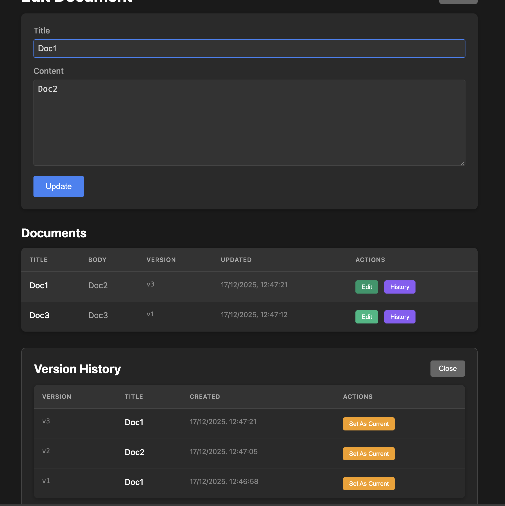

# Focument

A document management demo built with event sourcing and CQRS in C#.



**[Live Demo](https://novian.works/focument-csharp)**

F# version of this repo is at https://github.com/OnurGumus/focument

## What is this?

Focument is a simple web app that lets you create and edit documents with full version history. Every change is stored as an event, so you can see exactly what happened and roll back to any previous version.

The interesting part isn't the UI (it's deliberately minimal) - it's the architecture underneath. This project demonstrates how to build an event-sourced system using the actor model in .NET.

## Architecture

The app follows the CQRS (Command Query Responsibility Segregation) pattern:

**Write side (Commands)**
- Commands come in through the REST API
- Each document is managed by its own actor (using Akka.NET via Akkling)
- The actor validates the command and produces events
- Events are persisted to SQLite and broadcast to subscribers

**Read side (Queries)**
- A projection subscribes to the event stream
- It maintains a denormalized view optimized for reading
- Queries hit this projection directly - no need to replay events

**The flow looks like this:**

```
Browser -> API -> Command Handler -> Document Actor -> Event Store
                                                            |
                                                            v
                                          Projection <- Event Subscription
                                                |
Browser <- API <- Query Handler <---------------+
```

## Key files

- `src/Model/Command.cs` - Domain types: commands, events, value objects
- `src/Server/DocumentAggregate.cs` - The actor that handles document state
- `src/Server/DocumentApprovalSaga.cs` - A saga that runs when documents are created
- `src/Server/Projection.cs` - Builds the read model from events
- `src/Server/Handlers.cs` - HTTP request handlers

## Running locally

You'll need .NET 10 SDK.

```bash
# Run the server
dotnet run --project src/Server
```

Open http://localhost:5000 in your browser.

## How the version history works

When you edit a document, the system doesn't update a row in a database. Instead:

1. It creates a `CreatedOrUpdated` event with the new document state
2. The event gets persisted with a sequence number
3. The projection updates the "current" view
4. The event stays in the journal forever

When you click "History", it reads all events for that document and shows them as versions. "Set As Current" creates a new event that copies an old version forward.

## Tech stack

- **.NET 10** - The runtime
- **Akka.NET + Akkling** - Actor model for aggregate roots
- **[FCQRS](https://github.com/OnurGumus/FCQRS)** - A small library that wires up the CQRS/ES plumbing
- **SQLite** - Event store and read model
- **Vanilla JS** - No framework needed for a simple UI

## Deployment

The app runs on Kubernetes. See `Dockerfile` and `kubernetes-deployment.example.yaml` for the setup.

Key things for production:
- Uses `ASPNETCORE_PATHBASE` for subpath deployment
- Trusts `X-Forwarded-For` for rate limiting behind nginx
- Rate limits write operations to 30/minute per IP

## Why event sourcing?

For this demo? Mostly to show how it works. But event sourcing shines when you need:

- Complete audit trail of all changes
- Ability to replay events to fix bugs or build new projections
- Time-travel debugging
- Different read models for different use cases

The tradeoff is complexity. You're managing an event schema that needs to evolve over time, and eventually consistent reads take some getting used to.

## License

MIT
